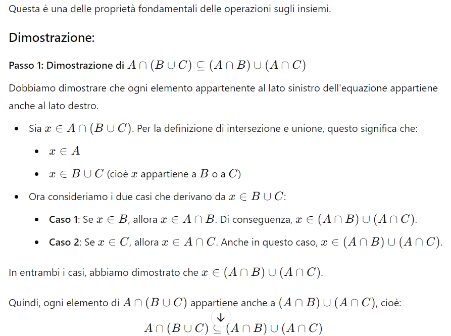
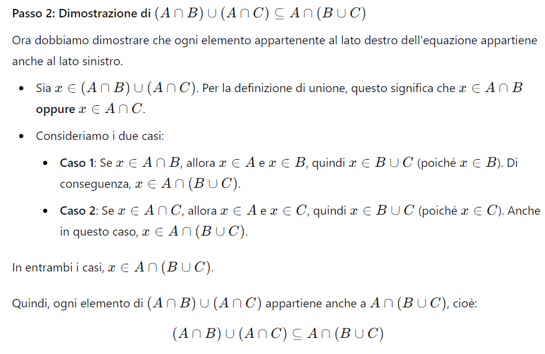

# Riconducibilità 
Molti problemi teorici sono riconducibili a quello della verifica dell'appartenenza di una frase a un linguaggio. Per farlo, si possono seguire diversi approcci:

- **Insiemistico**: descrizione del linguaggio tramite notazione insiemistica
- **Generativo**: si specificano le regole del linguaggio, e seguendo le regole si generato tutte ed esclusivamente le frasi che appartengono al linguaggio
- **Riconoscitivo**: il linguaggio è composto dalle frasi che sono riconosciute da un automa, quelle non riconosciute no
- **Statistico**: a un automa sono mostrate molte frasi di un linguaggio e l'automa genera o riconosce con una certa probabilità di errore le frasi che sono statisticamente simili a quelle proposte
 
# Concetti di base

## Insiemi
Esistono insiemi finiti e infiniti (ad esempio, i numeri naturali, razionali, reali, interi)
Un sottoinsieme si dice _proprio_ se non coincide con l'altro insieme.

### Sottoinsiemi
L'insieme delle **parti** di un insieme $A$ è l' insieme di tutti i sotto insiemi di $A$ (compreso l'insieme vuoto). 
Dato un insieme $A$ con cardinalità $|A|=n$, la sua cardinalità del suo insieme delle parti è $2^{n}$, dimostrato per induzione a partire dall'insieme vuoto, che ha $n = 0$.

### Operazioni

Unione: 

- $C=A\bigcup B$
- Commutativa e associativa
  
Intersezione:

- $C=A\bigcap B$
- Commutativa e associativa
- L'operazione di intersezione è distributiva rispetto all'unione.

Passo 1:

 {latex-placement="h"}

Passo 2:

 {latex-placement="h"}

Partizione di $A$:

- insieme di $n$ sottoinsiemi di $A$ tali che $A_1 \bigcup A_2 \ldots \bigcup A_n = A$, in cui dato $i\neq j \rightarrow A_i \bigcap A_j =\emptyset$ 

Completamento di $B$ rispetto ad $A$:

- composto da tutti gli elementi di $A$ che non appartengono a $B$

Differenza simmetrica o somma disgiunta tra $A$ e $B$:

- Tutti gli elementi di $A$ e $B$, meno quelli dell'intersezione tra $A$ e $B$

Prodotto cartesiano tra $A$ e $B$:

- insieme di tutte le possibili coppie ordinate
- Associativo ma _non_ commutativo

## Relazioni
Siano $A_1, A_2 \ldots, A_n$ $n$ insiemi, non necessariamente distinti.
Una **relazione** $n$-aria è un **sottoinsieme del prodotto cartesiano** tra questi $n$ insiemi.

Proprietà:

- Riflessività: $<x,x> \in R$
- Simmetria: $<x,y> \in R \Rightarrow <y,x> \in R$
- Antisimmetria: $<x,y> \in R \land <y,x> \in R \Rightarrow x=y$
- Transitività: $<x,y> \in R \land <y,z> \in R \Rightarrow x=z$

Relazione d'ordine: è una relazione riflessiva, **anti**simmetrica e transitiva.
Un insieme su cui è definita una relazione d'ordine si dice parzialmente ordinato (ad esempio la relazione $\leq$ su N – attenzione, non solo $<$ perché non è riflessiva).

Una relazione d'ordine si dice totale se vale in entrambe le "direzioni" $<a,b>$ e $<b,a> \in R$

Una relazione è di _equivalenza_ se è riflessiva, simmetrica e transitiva.
Un insieme su cui è definita una relazione di equivalenza $R$ si può partizionare in _classi di equivalenza_. L'insieme delle classi di equivalenza di $A$ è detto _insieme quoziente_ e si denota con $A/R$. Un elemento di $A/R$ si denota con $[A]$. Il numero delle classi si chiama _indice_ di $R$.

### Operazioni
Unione, complementazione, chiusura transitiva, chiusura transitiva e riflessiva. 

Chiusura transitiva: $R^+ = \{<x,y> | \exists y_1, \ldots , y_n \in A, n > 2, y_1 = x, y_n = y\}$  tali che $<y_i, y_{i+1} \in R, i=1, \ldots, n-1>$

Chiusura transitiva e riflessiva: $R^*=R^+ \bigcup \{<x,x> | x \in A \}$

## Funzioni
Consideriamo un insieme

$$
R \subseteq X_1 \times X_2 \times \dots \times X_n
$$
dove $R$ è una relazione.

### Relazione funzionale

La relazione $R$ si dice **funzionale** se vale questa condizione:

Per ogni tupla $(x_1, x_2, \dots, x_{n-1}) \in X_1 \times X_2 \times \dots \times X_{n-1}$ esiste **al più un** elemento $x_n \in X_n$ tale che
- [ ] - [ ] 
$$
(x_1, x_2, \dots, x_{n-1}, x_n) \in R.
$$
In parole semplici: se fissiamo i primi $n-1$ elementi, possiamo avere al massimo **un solo** valore per l’ultimo elemento.

### Definizione di funzione

Se $R$ è funzionale, possiamo definire una **funzione** $f$ che associa a ogni
$(x_1, \dots, x_{n-1})$ il corrispondente valore $x_n$:

$$
f(x_1, \dots, x_{n-1}) = x_n
$$
cioè $f : X_1 \times X_2 \times \dots \times X_{n-1} \longrightarrow X_n$

Il dominio della funzione (cioè $X_1 \times X_2 \times \dots \times X_{n-1}$) si chiama **tipo della funzione**.

Il **dominio** di una funzione $f$ (indicato con $\text{dom}(f)$) è l’insieme di tutti gli argomenti per cui la funzione è definita.
* È un sottoinsieme di $X_1 \times X_2 \times \dots \times X_{n-1}.$

Formalmente:

$$
\text{dom}(f) = \{ (x_1, \dots, x_{n-1}) \in X_1 \times \dots \times X_{n-1} \;|\; \exists x_n \in X_n : f(x_1,\dots, x_{n-1}) = x_n \}.
$$

Il **codominio** di una funzione $f$ (indicato con $\text{cod}(f)$) è l’insieme di tutti i valori che la funzione può assumere. È un sottoinsieme di $X_n$.

Formalmente:

$$
\text{cod}(f) = \{ x_n \in X_n \;|\; \exists (x_1, \dots, x_{n-1}) \in X_1 \times \dots \times X_{n-1} \; \text{tale che } f(x_1, \dots, x_{n-1}) = x_n \}.
$$
 In sintesi:

- **dom(f)** = insieme degli input possibili della funzione.
- **cod(f)** = insieme dei valori effettivamente prodotti dalla funzione.

### Fibra (o controimmagine)
Dato un elemento $x_n \in X_n$, si definisce la sua **fibra** (o controimmagine) rispetto alla funzione $f$ come:

$$
f^{-1}(x_n)
$$
La fibra di $x_n$ è l’insieme di tutti gli argomenti $(x_1, \dots, x_{n-1})$ del dominio tali che la funzione restituisce proprio $x_n$.

Formalmente:

$$
f^{-1}(x_n) = \{ (x_1, \dots, x_{n-1}) \in X_1 \times \dots \times X_{n-1} \;\;|\;\; (x_1, \dots, x_{n-1}) \in \text{dom}(f) \;\wedge\; f(x_1,\dots,x_{n-1}) = x_n \}.
$$
In parole semplici:

- La **fibra** di un valore $x_n$ è l’insieme di tutti gli input che la funzione manda in $x_n$.
- È un sottoinsieme del dominio della funzione.

#### Esempio

Se $f:\mathbb{N}\to\mathbb{N}, f(x)=x^2$:

- $f^{-1}(4) = \{2, -2\}$ (tutti i numeri che la funzione manda a 4).
- $f^{-1}(5) = \varnothing$ (nessun numero intero ha quadrato uguale a 5).

### Totalità, iniettività, suriettività, biettività

Sia $f : X \to Y$ una funzione.

$f$ è **totale** se è definita su **tutto il dominio** $X$, ossia $dom(f) = X$.

$$
\forall x \in X \;\; \exists y \in Y : f(x) = y
$$
$f$ è **iniettiva** se **valori diversi del dominio hanno immagini diverse**, ossia se $|f^{-1}(x_n)|=1$.

$$
\forall x_1, x_2 \in X, \; f(x_1) = f(x_2) \;\;\Rightarrow\;\; x_1 = x_2
$$
$f$ è **suriettiva** se **ogni elemento del codominio è immagine di almeno un elemento del dominio**, ossia se $cod(f)=Y$.

$$
\forall y \in Y \;\; \exists x \in X : f(x) = y
$$

$f$ è **biettiva** se è **iniettiva, suriettiva e totale** contemporaneamente.

- Ogni elemento di $Y$ ha **esattamente uno** $x \in X$ che lo mappa.
- In questo caso $f$ è invertibile, e la sua inversa è anch’essa una funzione:

$$
f^{-1} : Y \to X
$$

# Linguaggi

## Alfabeto
Un alfabeto è un insieme finito non vuoto di caratteri. 
Dato un alfabeto $\Sigma$, definiamo l'operazione binaria concatenazione ($\circ$)

$$
a \circ b = ab, \text{con } a, b \in \Sigma
$$
Indichiamo con $a^n$ la concatenazione di $a$ con se stessa $n$ volte.

La concatenazione è associativa ma non commutativa.

Dati $\Sigma$ e $\circ$, definiamo $\Sigma^+$ come l'insieme delle stringhe (parole) di lunghezza finita. Se a $\Sigma^+$ aggiungiamo la stringa vuota $\epsilon = ""$, otteniamo $\Sigma^\star$.

## Definizione di linguaggio
Un linguaggio è un sottoinsieme di $\Sigma^\star$ e contiene stringhe di lunghezza finita ma in numero finito o infinito. 
$\Sigma^\star$ è detto linguaggio universale.
Il linguaggio vuoto $\Lambda$ non contiene stringhe, e coincide con l'insieme vuoto.

> **Attenzione**: non contiene nemmeno la stringa vuota $\epsilon$.
 
## Operazioni sui linguaggi
- **Unione**: metto insieme le stringhe dei due linguaggi.
	- Facendo l'unione con il linguaggio vuoto si riottiene lo stesso linguaggio;
- **Intersezione**: solo le stringhe in comune.
- **Complementazione** di un linguaggio: il riferimento è $\Sigma^\star$, la complementazione è fatta rispetto a $\Sigma^\star$:
	- il complemento di L1, è l'insieme delle stringhe x che appartengono a $\Sigma^\star$ ma che non appartengono a L1: --> parte rossa
- **Concatenazione** tra linguaggi: prendi i due linguaggi e quando li concateni prendi qualunque stringa di L1 e di L2 e le concateni tra loro, in tutti i possibili modi. Così ottengo la concatenazione dei due linguaggi.
	- $a^n$ --> linguaggio di stringhe che contiene solo a;
	- $b^m$ --> uguale a sopra ma contiene solo b;
	- Se calcolo la loro concatenazione: ottengo stringhe che hanno prima tutte a e poi tutte b. la stringa "abb" c'è? Si. "ba" invece non c'è perché la concatenazione non è commutativa
- **Potenza** di un linguaggio: concatenazione di un linguaggio con se stesso per n volte.
	- $L^0$ è un linguaggio contenente solo la stringa vuota.
	- $L^h$ --> concateno le stringhe del linguaggio L, h volte
	  
### Operatore di Kleene
Chiusura riflessiva e transitiva di un linguaggio: 

$$
L^\star = \bigcup_{h=0}^\infty L^h
$$
con $\epsilon \in L^\star$ e $\Lambda^\star = \{\epsilon\}$

Chiusura transitiva (non riflessiva) di un linguaggio

$$
L^+ = \bigcup_{h=1}^\infty L^h
$$
con $L^\star = L^+ \bigcup \{\epsilon\}$

## Espressioni regolari
Le espressioni regolari sono strumenti utilizzati per descrivere i linguaggi. Dato un alfabeto regolare $\Sigma$, si definisce _espressione regolare_ ogni stringa $r$ 

$$
r \in (\Sigma \bigcup \{+,\star, (, ), \circ, \emptyset \})^+
$$
tale che $r=\emptyset$, oppure $r\in \Sigma$, oppure $r=(s+t)$, oppure $r=(s\circ t)$ oppure $r=s	^\star$, con $s$ e $t$ espressioni regolari.

> Non sempre esiste un'espressione regolare che rappresenta un linguaggio (che è un sottoinsieme di $\Sigma^\star$)

# Grammatiche di Chomsky
La grammatica di Chomsky è una quadrupla

$$
G=<V_T,V_N,P,S>
$$

dove:

- $V_T\subseteq\Sigma$ è l'alfabeto finito di simboli terminali; 
- $V_N$ è l'insieme finito di simboli non terminali;
- $P$ è l'insieme delle produzioni, che consiste in una relazione binaria finita su $(V_T\bigcup V_N)^\star \circ V_N \circ (V_T\bigcup V_N)^\star \times (V_T\bigcup V_N)^\star$;
- $S\in V_N$ è l'assioma.

Il processo generativo parte dall'assioma, si applicano le produzioni, la stringa cambia aspetto fino a divenire una stringa di soli terminali. Se così diventa solo di terminali, allora appartiene alla grammatica $G$.
$L(G)$ è il linguaggio generato dalla grammatica $G$.

La _derivazione diretta_ è una relazione su

$$
(V^\star \circ V_N \circ V^\star) \times V^\star
$$
$\varphi$ e $\psi$ sono dette _forme di frase_, ossia delle "fotografie intermedie" ottenute durante le trasformazioni, prima di arrivare ad una stringa di soli terminali che è anche, quindi, una stringa del linguaggio.

> Non è detto che una sequenza di derivazioni porti ad una stringa del linguaggio.

## Tipo 0: non limitate
Sono le meno restrittive e hanno produzioni del tipo

$$
\alpha \rightarrow \beta, \alpha \in (V^\star \circ V_N \circ V^\star), \beta \in V^\star
$$
e ammettono anche derivazioni che accorciano stringhe.
hanno produzioni con a sx come vuoi basta che ci sia un non terminale e a dx quello che ti pare.

> Se compare $\epsilon$, la grammatica sarà sicuramente di tipo $0$

## Tipo 1: contestuali
Si tratta di produzioni che non riducono la lunghezza delle forme di frase

$$
\alpha \rightarrow \beta, |\alpha| \leq |\beta|, \alpha \in (V^\star \circ V_N \circ V^\star), \beta \in V^\star
$$
hanno a sx e a dx come prima ma la cardinalità di sx deve essere minore o uguale di quella di dx. le forme di frase NON possono essere accorciate, al massimo rimangono della stessa lunghezza.

>Un linguaggio può essere generato da due distinte grammatiche di tipo diverso. Un linguaggio di tipo 0 non è detto che sia di tipo 1. Mentre se è di tipo 1 è anche di tipo 0.
## Tipo 2: non contestuali
Hanno produzioni del tipo

$$
A\rightarrow \gamma, A \in V_N, \gamma \in V^+
$$
Caratteristica: a dx le produzioni possono avere qualunque cosa, ma a sx solo 1 simbolo non terminale.

V+ --> vuol dire che a dx qualcosa ci deve essere, non ci sta la stringa vuota.

## Tipo 3: regolari
Hanno produzioni del tipo

$$
A\rightarrow \delta, A \in V_N, \delta \in (V_T \circ V_N) \bigcup V_T
$$
Caratteristica: A sx un solo non terminale e a dx o terminale o  terminale seguito da non terminale.

> Un linguaggio è strettamente di tipo $n$ se esiste una grammatica di tipo $n$ che lo genera e non esiste una grammatica di tipo $m>n$ che lo genera.

## $\epsilon$-produzioni
Con grammatiche di tipo 1, 2, e 3 non è possibile generare la stringa vuota $\epsilon$. Per Chomksy, tutte le grammatiche che contengono questo tipo di produzioni sono di tipo 0.