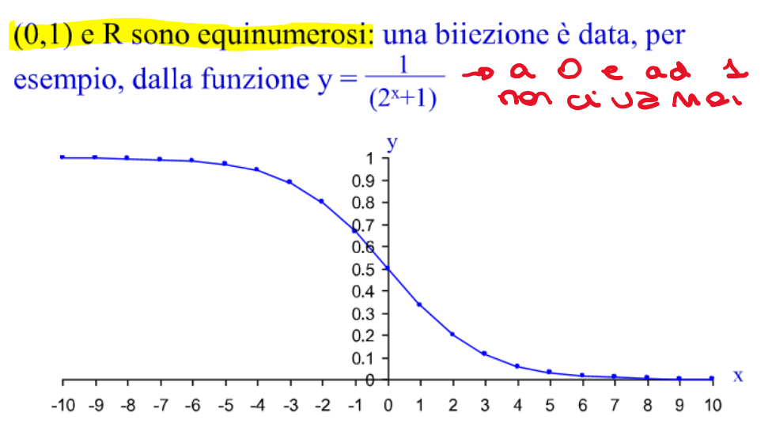
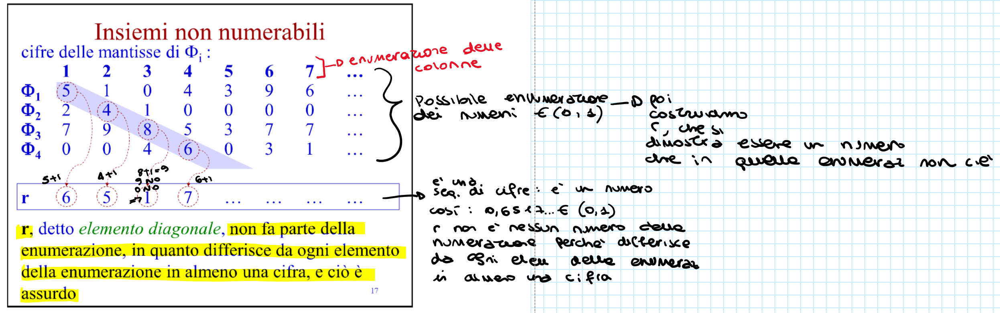

# Cardinalità transfinite 
Si tratta della cardinalità di un insieme infinito. Vogliamo vedere se 2 insieme infiniti sono uno più grande dell'altro (nonostante l'infinità). 
> Spoiler: sono tutti uguali

## Pidgeonole Principle
Dati due insiemi $A$ e $B$ tali che 

$$
0 < |B| < |A| < \infty
$$
non esiste una funzione $f: A\rightarrow B$ che sia **totale** e **iniettiva**.  

La dimostrazione è basata sulla cardinalità di $B$ e per induzione.

### Passo base: $|B|=1$
$B=\{b\}, |A|>1$. 

Se $f$ è totale, allora $f(a_1)=b$ e $f(a_2)=b$, ma allora $f$ non è iniettiva perché $|f^{-1}(B)|>1$

### Passo induttivo: $|B|>1$
Supponiamo sia vero per $|B|=n$ e $|A|\geq n+1$. Dimostriamo che è vero per $|B|=n+1$ e $|A|\geq n+2$.
Ipotizziamo per assurdo che esista una funzione totale iniettiva $f$ e scegliamo un qualunque elemento $b$ di $B$. 
Se $|f^{-1}(B)|>1 \Rightarrow$ contraddizione, dunque teorema dimostrato. Se $|f^{-1}(B)|\leq1$ consideriamo $A' =A-\{f^{-1}(b)\}$ e $B' = B-\{b\}$

$$
|A'| \geq n+1 > |B'|=n
$$
Applicando l'ipotesi induttiva si giunge a una contraddizione.

> _Non esiste una funzione induttiva che possa legarli_.

### Considerazioni

Il pidgeonhole principle mette in relazione la numerosità degli insiemi con le proprietà delle funzioni, i cui domini e codomini sono insiemi. In particolare, se esiste una funzione biettiva $f: A \rightarrow B$;
Il pidgeonhole principle mette in relazione la numerosità degli insiemi con le proprietà delle funzioni, i cui domini e codomini sono insiemi. In particolare, se esiste una funzione biettiva $f: A \rightarrow B$;

- esiste una funzione totale e iniettiva $f: A \rightarrow B$;
- esiste una funzione totale e iniettiva $f^{-1}: B \rightarrow A$;
- per il pidgeonhole principle, se $A$ e $B$ sono insiemi finiti, non può essere $|B|>|A|$ né $|A|>|B|$.

Dunque, devono avere la stessa cardinalità.

 Due insiemi sono _equinumerosi_ se esiste una biiezione tra essi (ossia una funzione biettiva che li lega). La relazione di equinumerosità è una **relazione di equivalenza** – riflessiva, simmetrica e transivita.

# Numerabilità

Un insieme è **numerabile** se è equinumeroso a $N$ (l'insieme dei numeri naturali). Un insieme ha cardinalità _aleph zero_ ($\aleph_0$) se è equinumeroso a N, cioè se è numerabile.

Un insieme è **contabile** se è finito o numerabile. I sottoinsiemi di insiemi contabili sono contabilil.

## $\aleph_0 + k = \aleph_0$
Per ogni intero $k$, l'insieme $N_k$ degli interi maggiori o uguali a $k$ è numerabile.

## Numerabilità degli interi relativi
L'insieme $Z$ degli interi relativi è numerabile.

{latex-placement="h"}

## Insiemi non numerabili
Per dimostrare la non numerabilità di un insieme si usa la tecnica di diagonalizzazione di Cantor. Dimostriamo che $R$ è equinumeroso a $(0,1)$ e che $(0,1)$ non è equinumeroso.

{latex-placement="h"}

Supponiamo per assurdo che una enumerazione di $(0,1)$ esista, denotiamo con $\phi_i$ l'i-esimo elemento di $(0,1)$. Consideriamo $r\in (0,1)$ che ha come i-esima cifra della mantissa $(i=1,2, \dots)$ un valore diverso da $0$ a $9$ e dal valore della i-esima cifra di $\phi_i$.0

{latex-placement="h"}

Le cifre dell'elemento diagonale $r$ sono scelte in modo da essere diverse da $0$ e da $9$:

- non si può generare la mantissa $0000\dots$  che non appartiene all'insieme;
- non si possono generare numeri terminanti con $9$ periodico che corrispondono ad una seconda rappresentazione di un numero non periodico ($0.999$ che coincide con $1$)

### $P(N)$ non è numerabile
L'insieme delle parti di $N$ non è numerabile. 

Supponiamo per assurdo che lo sia, e sia $P_1, P_2, \dots, P_i, \dots$ una sua enumerazione. A ciascun $P_i$ associamo la sequenza $b_{i0}, b_{i1}, b_{i2},\dots$ dove 

$$
\begin{aligned}
b_{ij} = 0 \text{ se } j \notin P_i\\
b_{ij} = 1 \text{ se } j \in P_i
\end{aligned}
$$
Costruiamo ora l'insieme $P$ (diagonale) con sequenza $p_0, p_1, \dots, p_k,\dots$ dove $p_k = 1-b_{kk}$. $P$ differisce da ogni $P_i$ in quanto $i\in P \Leftrightarrow i \in P_i$.

> Osservazione. La non numerabilità di $P(N)$ vale anche per l'insieme delle parti di ogni insieme di cardinalità $\aleph_0$.

### $R$ è equinumeroso a $P(N)$
$R$ e $P(N)$ non sono numerabili. Se sono equinumerosi esiste una biiezione tra essi.
Per dimostrarlo è sufficiente mostrare che la proprioetà vale per i reali in $(0,1)$, vista la biiezione tra $R$ e $(0,1)$.

## Notazione $\aleph$
Se un insieme finito ha cardinalità $n$, il suo insieme delle parti ha cardinalità $2^n$.
Analogamente, se un insieme delle parti ha cardinalità $\aleph_0$, denotiamo con $2^{\aleph_0}$ la cardinalità del suo insieme delle parti. 

Gli insiemi con cardinalità $2^{\aleph_0}$  sono detti continui. Cantor ha dimostrato che esistono infiniti cardinali transfiniti $(\aleph_0,2^{\aleph_0}, 2^{2^{\aleph_0}}, \dots)$

# Conseguenze della teoria
Le considerazioni sulla cardinalità degli insiemi infiniti danno spunti interessanti sulla effettiva possibilità di risolvere problemi utilizzando calcolatori.

> Un linguaggio è un sottoinsieme di $\Sigma^\star$.

**Qual è la cardinalità di $\Sigma^\star$? **$\Sigma^\star$ è un insieme infinito. Però le stringhe sono di lunghezza finita. La sua cardinalità è $\aleph_0$ dato cvhe sono infinite stringhe di lunghezza finita e posso scandirle in un tempo finito. Mettere tutte le stringhe in ordine alfabeticio e contarle, però, non si può fare. 1. Come la costruisco la corrispondenza biunivoca? Si fa con: {epsilon, a, b. aa, ab, ba, bb…}--> ordinamento lessicografico. Questo fa si che se ho una stringa di 150 caratteri tu sai quale è il numero che gli corrisponde. Non devo aspettare infinte stringhe per sapere a quale numero corrisponde

**Qual è la cardinalità di $P(\Sigma^\star)$?** $2^{\aleph_0}$, qualunque insieme equinumeroso a $N$

**Quanti linguaggi esistono?** I sottoinsiemi di sigma asteriscato sono $2^{\aleph_0}$, quindi sono $2^{\aleph_0}$ linguaggi esistenti.

Un programma in un linguaggio di programmazione qualsiasi può essere considerato come una sequenza finita di caratteri. **Quanti sono i possibili programmi che si possono scrivere?** I programmi che li possono risolvere sono $\aleph_0$, ci sono più problemi che programmi--> esistono problemi che non posso risolvere.
